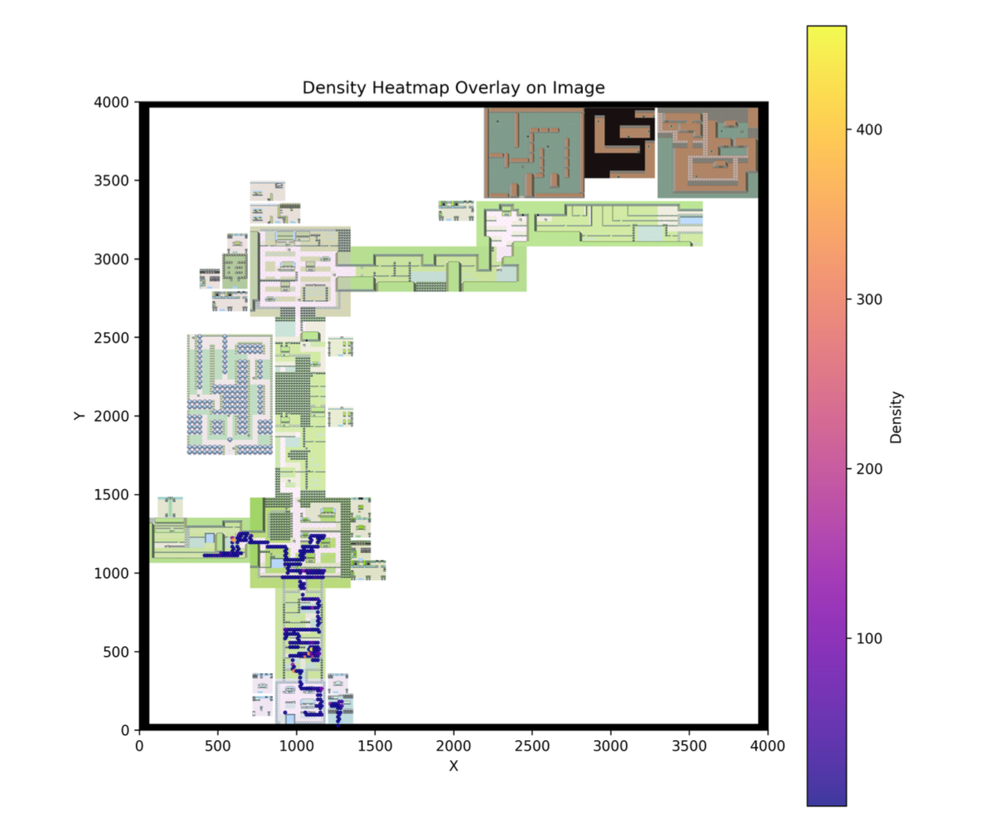

# Introduction
Some algorithms developed within the framework of deep reinforcement learning, aimed at training an agent to play a video game, can sometimes be less effective. For example, in some more complex games that require the agent to explore different possibilities more thoroughly, such as Pokémon or MONTEZUMA’S REVENGE, traditional methods may struggle to maintain a high level of exploration in very long games or to "choose" when to explore when encountering new "zones" or situations. For this type of game, it is often necessary to add a stronger incentive for exploration so that the agent learns to navigate its environment correctly. In this project, we focused on adding a GAN, particularly the discriminator part of a GAN trained on the images seen during the agent's training. The advantage of the GAN here is its unsupervised nature, which allows us to train the discriminator simply by providing images of the game encountered by the agent without the need for labeling. We will thus study the impact that adding such a discriminator can have on the behavior of a DQN agent.

# Method
Using the RLlib and Gymnasium framework, we propose a simple method to enhance exploration by replacing the classic epsilon-greedy DQN exploration paradigm with the following mechanism:
* If the GAN discriminator recognizes an image already seen in past training, the agent chooses an action greedily.
* Otherwise, the agent takes an action randomly.

# Validation metric
To observe and validate a good exploration behavior of the agent, we choose to plot the density of movement of the agent in Pokemon world through the plot of a heatmap.

# Suggestions for Improvement
If the whole pipeline works, many points remain to be developed to see interesting results:
* Increase the number of training iterations.
* Improve GAN convergence and discriminator efficiency.
* Change the exploration paradigm by including an internal exploration reward (similar to the Agent57 algorithm).
* Tune hyperparameters using Ray parallelization.

